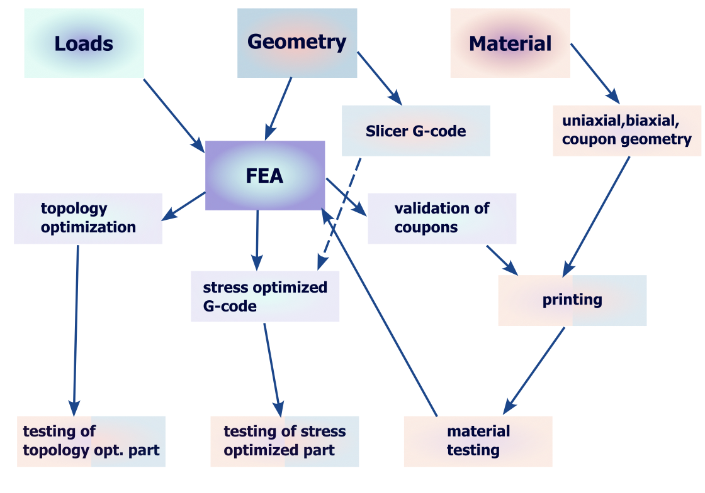

# Optimization of the infill of 3D printed parts

#### created by
```bat
PÁL Tímea
NAGY Ábel Mihály
HAVASI Kristóf
HORVÁTH Gergely Zoltán
BAUER Balázs László
```
>University Project - BME


As 3D printing technologies continue to develop a new era of optimization rises. Nonlinearity and complex structures come hand in hand; especially with 3D printed parts and hyperelastic materials with various fields of application.

There are several reasons for its rapid spread and success. The most impressive feature of the technology is the low weight. Based on this the manufacturing costs and also lower fuel consumption are reduced. Using 3D printers to prototypes and spare parts leads to shorter time in production and its make the modification of the model more flexible.

Weight vs strength; this question holds great opportunity for improvement, real-world examples: e.g. plastic drone parts, force-critic situations in everyday equipment and digital technology in human-device interactions, where due to the enormous volume of production small weight decrease lead to massive resource savings.


## Requirements
<!-- Task List -->
* [x] Python 3.10
* [x] ANSYS 2021 R2
* [x] G-code Slicer - CraftWare Pro

<!-- Images -->

